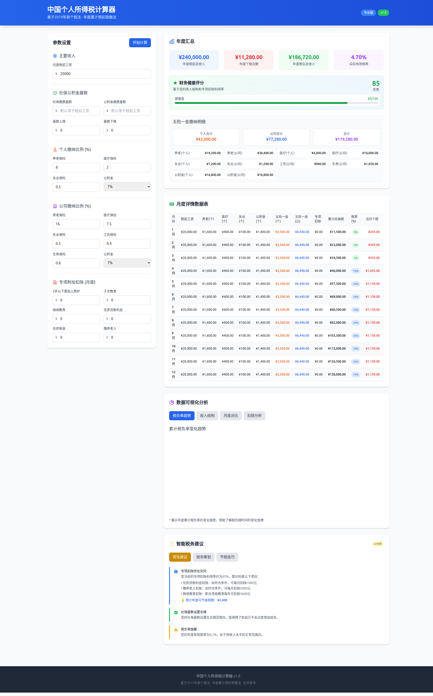
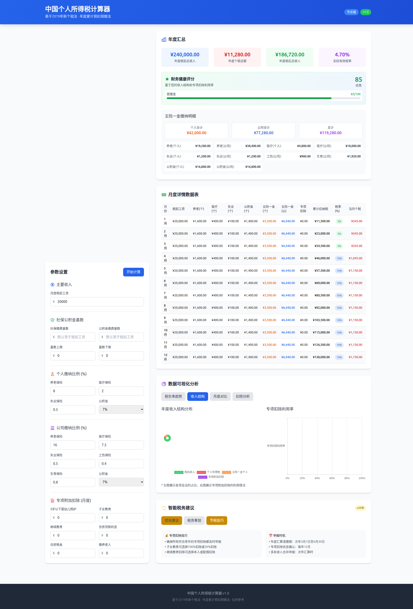

# 中国个人所得税计算器 🚀

一个专业、智能、交互式的中国个人所得税（年度累计预扣预缴）计算器，采用现代化技术架构和AI驱动的个性化建议系统。不仅提供精准的税务计算，还配备丰富的数据可视化和智能税务优化建议，帮助用户全面了解个人税务状况并优化税负。

## 📑 目录

- [🖼️ 项目预览](#-项目预览)
- [🚀 快速开始](#-快速开始)
- [📱 使用说明](#-使用说明)
- [⚙️ 高级配置](#️-高级配置)
- [🔧 API接口](#-api接口)
- [📱 响应式设计](#-响应式设计)
- [📁 项目结构](#-项目结构)
- [✅ 最新改进](#-最新改进)
- [⚠️ 免责声明](#️-免责声明)

## ✨ 核心特性

### 🧮 智能计算引擎
- **精准算法**: 基于2019年新个税法，严格按累计预扣预缴法计算
- **实时计算**: 输入防抖技术，自动触发计算，无延迟体验
- **灵活配置**: 支持社保公积金基数分离、上下限设置等高度自定义

### 📊 多维度数据可视化
- **4种图表类型**: 税负率趋势、收入结构、月度对比、扣除分析
- **交互式图表**: 支持标签页切换，数据动态渲染
- **专业图表库**: 基于Chart.js构建的高质量数据可视化

### 🤖 AI驱动个性化建议
- **智能财务健康评分**: 基于收入结构和扣除利用率的综合评分系统
- **三大建议模块**: 优化建议、税务筹划、节税技巧
- **精准分析**: AI分析专项扣除优化空间，提供具体节税方案

### 🎨 现代化用户界面
- **响应式设计**: 完美适配桌面、平板、手机等各种设备
- **现代UI**: 采用Tailwind CSS构建的美观界面，支持暗色模式
- **流畅动画**: 丰富的过渡效果和交互反馈

## 🏗️ 技术架构

### 后端 (Python)
- **FastAPI**: 现代、快速的Web框架
- **Pydantic**: 数据验证和序列化
- **Uvicorn**: ASGI服务器
- **uv**: 新一代Python包管理工具

### 前端 (HTML/CSS/JavaScript)
- **HTML5**: 语义化结构
- **Tailwind CSS**: 实用优先的CSS框架
- **Chart.js**: 数据可视化图表库
- **Vanilla JavaScript**: 原生ES6+，无额外依赖

## 🖼️ 项目预览

### 🎯 主界面全景


**增强的主界面特色**：
- 智能财务健康评分卡片（85/100优秀评级）
- 关键指标悬浮效果和过渡动画
- 清晰的数据层级和视觉引导

### 📊 多维度数据可视化


**收入结构与扣除分析优化**：


**可视化亮点**：
- **税负率趋势图**: 展示累计税率变化规律
- **收入结构图**: 饼图显示收支占比分布
- **扣除分析图**: 双图表展示专项扣除影响
- **专项扣除利用率**: 分析优化空间
- **交互式标签页**: 流畅的图表切换体验

### 🤖 AI智能建议系统


**智能建议特色**：
- **优化建议**: 专项扣除优化分析，预计节省¥2,400
- **税务筹划**: 年终奖分摊策略，节省10-15%税额
- **节税技巧**: 实用税务优化技巧和申报时机提醒

### 📱 移动端完美适配


**移动端优化**：
- 触摸友好的交互设计
- 自适应布局和字体大小
- 完整功能在移动端同样可用

## 🚀 快速开始

### 环境要求
- Python 3.8+
- uv (现代Python包管理器，**强烈推荐**)

### 📦 安装 uv (如果尚未安装)

```bash
# 官方推荐安装方法
curl -LsSf https://astral.sh/uv/install.sh | sh

# 或使用包管理器
# macOS
brew install uv

# Windows (PowerShell)
irm https://astral.sh/uv/install.ps1 | iex

# 更多安装方法请访问: https://github.com/astral-sh/uv
```

### 🎯 一键启动 (推荐)

根据您的操作系统选择对应的启动脚本：

#### 🪟 Windows 用户
双击运行或在命令行执行：
```cmd
start.bat
```

#### 🍎 macOS 用户
双击运行或在终端执行：
```bash
./start_macos.command
```

#### 🐧 Linux 用户
在终端执行：
```bash
./start_linux.sh
```

> 💡 **推荐使用各系统专用的启动脚本**，它们会自动处理系统特定的配置和优化。

**所有启动脚本都会自动：**
- 检查系统环境 (Python、uv安装状态)
- 检测并显示系统信息
- 同步项目依赖
- 智能端口冲突检测和处理
- 启动后端API服务
- 启动前端HTTP服务器
- 测试CORS跨域配置
- 提供访问地址和使用说明
- 发送桌面通知 (macOS/Linux)
- 优雅的服务停止处理

### 🔧 手动启动

#### 1. 安装依赖
```bash
# 同步项目依赖
uv sync

# 安装开发依赖（可选）
uv sync --group dev
```

#### 2. 启动后端服务
```bash
# 启动生产环境服务
uv run python app.py

# 开发环境（自动重载）
uv run python app.py --reload

# 自定义端口和主机
uv run python app.py --host 0.0.0.0 --port 8080

# 多进程模式
uv run python app.py --workers 4
```

#### 3. 启动前端服务
```bash
# 启动前端HTTP服务器
uv run python -m http.server 3000

# 然后访问 http://localhost:3000
```

### 🛠️ 使用 Makefile (推荐)

项目提供了完整的Makefile来简化常用操作：

```bash
# 查看所有可用命令
make help

# 安装依赖
make install
make dev

# 运行服务
make start
make dev-run

# 测试和检查
make test
make check-api
make lint
make format

# 完整项目检查
make check

# 清理缓存
make clean
```

### 📋 启动选项

应用支持以下命令行参数：

```bash
uv run python app.py --help
```

可用选项：
- `--host HOST`: 服务器监听地址 (默认: 0.0.0.0)
- `--port PORT`: 服务器端口 (默认: 8000)
- `--reload`: 启用自动重载 (开发模式)
- `--workers WORKERS`: 工作进程数量 (默认: 1)

### 📚 开发环境

```bash
# 启动开发服务器（支持热重载）
make dev-run

# 代码风格检查
make lint

# 代码格式化
make format

# 运行测试
make test

# 检查API状态
make check-api
```

## 📱 使用说明

### 🎯 基本操作流程

1. **输入收入信息**: 在左侧表单输入月度税前工资
2. **配置社保公积金**: 设置缴费基数和比例（可留空使用默认值）
3. **设置专项扣除**: 填写适用的专项附加扣除金额
4. **查看智能结果**: 自动显示完整的分析报告和建议

### 📊 增强版计算结果展示

应用计算完成后会显示四大主要模块：

#### 🏆 智能财务健康评分
- **综合评分**: 基于收入结构和专项扣除利用率的智能评分
- **健康等级**: 优秀/良好/一般/需改进 四级评价体系
- **可视化进度条**: 直观展示财务健康状态

#### 📈 年度汇总面板
- 年度税前总收入、个税总额、税后总收入
- 实际有效税率分析
- 详细的五险一金缴纳明细（个人+公司）
- 悬浮动画效果增强用户体验

#### 📋 月度详情数据表
完整的12个月数据，包含：
- 税前工资和各项扣除明细
- 累计应纳税所得额和适用税率
- 当月个税和税后收入
- 智能表格设计，支持数据查看

#### 📊 多维度数据可视化
**四种图表类型**：
- **税负率趋势**: 线图展示累计税率变化
- **收入结构**: 饼图分析收支占比
- **月度对比**: 柱状图对比收入变化
- **扣除分析**: 双图表展示扣除影响

#### 🤖 AI个性化建议系统
**三大智能模块**：
- **优化建议**: 分析专项扣除优化空间，计算具体节省金额
- **税务筹划**: 提供年终奖分摊等策略建议
- **节税技巧**: 实用的税务优化技巧和申报时机提醒

### 🔥 新功能亮点

#### 🧠 智能财务健康评分
- **算法引擎**: 综合考虑收入水平、税负率、专项扣除利用率
- **评分范围**: 0-100分，提供优秀的财务状况评估
- **分级标准**:
  - 80-100分：优秀（财务状况良好）
  - 60-79分：良好（有优化空间）
  - 40-59分：一般（需要改进）
  - 0-39分：需改进（财务压力大）

#### 📊 高级数据可视化
- **交互式图表**: 支持标签页切换，数据动态更新
- **专业图表库**: Chart.js提供高质量渲染
- **响应式设计**: 自适应不同屏幕尺寸

#### 🤖 AI驱动的个性化建议
- **精准分析**: 基于用户数据的智能分析算法
- **具体方案**: 提供可量化的节税建议
- **实用技巧**: 包含申报时机和策略建议

## ⚙️ 高级配置

### 社保公积金基数分离
- **社保缴费基数**: 可独立设置，默认等于税前工资
- **公积金缴费基数**: 可独立设置，默认等于税前工资
- **基数上下限**: 支持设置缴费基数范围，自动应用限制

### 税率设置
使用2019年新个税法7级超额累进税率表：

| 累计应纳税所得额 | 税率 | 速算扣除数 |
|----------------|------|------------|
| ≤ 36,000元 | 3% | 0 |
| 36,000-144,000元 | 10% | 2,520 |
| 144,000-300,000元 | 20% | 16,920 |
| 300,000-420,000元 | 25% | 31,920 |
| 420,000-660,000元 | 30% | 52,920 |
| 660,000-960,000元 | 35% | 85,920 |
| > 960,000元 | 45% | 181,920 |

### 专项附加扣除
支持全部七项专项附加扣除：
- 3岁以下婴幼儿照护
- 子女教育
- 继续教育
- 住房贷款利息
- 住房租金
- 赡养老人

## 🔧 API接口

应用提供完整的 RESTful API，配合专业的 Swagger 文档界面：


### 计算接口
```
POST /calculate
Content-Type: application/json

{
  "monthly_salary": 15000,
  "social_insurance_base": 15000,
  "housing_fund_base": 15000,
  "base_upper_limit": 25000,
  "base_lower_limit": 5000,
  "pension_personal_rate": 8,
  "medical_personal_rate": 2,
  "unemployment_personal_rate": 0.5,
  "housing_fund_personal_rate": 7,
  "pension_company_rate": 16,
  "medical_company_rate": 7.5,
  "unemployment_company_rate": 0.5,
  "work_injury_company_rate": 0.4,
  "maternity_company_rate": 0.8,
  "housing_fund_company_rate": 7,
  "infant_care": 0,
  "children_education": 0,
  "continuing_education": 0,
  "housing_loan_interest": 0,
  "housing_rent": 0,
  "elder_care": 0
}
```

### 响应示例
```json
{
  "annual_salary": 180000.0,
  "annual_tax": 10890.0,
  "annual_after_tax_income": 152310.0,
  "annual_social_personal": 30600.0,
  "annual_social_company": 43680.0,
  "annual_pension_personal": 14400.0,
  "annual_pension_company": 28800.0,
  "annual_medical_personal": 3600.0,
  "annual_medical_company": 13500.0,
  "annual_unemployment_personal": 900.0,
  "annual_unemployment_company": 900.0,
  "annual_work_injury_company": 720.0,
  "annual_maternity_company": 1440.0,
  "annual_housing_fund_personal": 11700.0,
  "annual_housing_fund_company": 11700.0,
  "monthly_details": [...]
}
```

## 🔧 启动脚本特性

### 🪟 Windows (start.bat)
- **自动编码设置**: 支持中文显示
- **进程管理**: 智能启动和停止服务
- **错误处理**: 详细的错误提示和解决方案
- **端口检测**: 自动检测端口占用情况
- **兼容性**: 支持 Windows 7/8/10/11

### 🍎 macOS (start_macos.command)
- **系统检测**: 自动识别macOS版本
- **桌面通知**: 服务启动后发送系统通知
- **颜色输出**: 美观的终端彩色显示
- **权限处理**: 自动处理文件执行权限
- **兼容性**: 支持 macOS 10.14+

### 🐧 Linux (start_linux.sh)
- **发行版检测**: 自动识别Ubuntu/Debian/CentOS/Fedora/Arch等
- **包管理器集成**: 针对不同发行版提供安装建议
- **防火墙提示**: 智能检测和配置防火墙建议
- **桌面通知**: 支持多种Linux桌面环境通知
- **端口检查**: 使用多种工具检测端口占用

### 🔧 故障排除

如果启动脚本遇到问题，请参考：
1. **TROUBLESHOOTING.md** - 详细故障排除指南
2. **检查依赖**: 确保Python 3.8+和uv已正确安装
3. **端口冲突**: 使用 `--port` 参数指定不同端口
4. **权限问题**: Linux/macOS确保脚本有执行权限 (`chmod +x`)

### 💡 高级用法

```bash
# 自定义端口启动
uv run python app.py --port 8080

# 开发模式（自动重载）
uv run python app.py --reload

# 多进程模式（生产环境）
uv run python app.py --workers 4

# 绑定到所有网络接口
uv run python app.py --host 0.0.0.0
```

## 📱 响应式设计

应用采用完全响应式设计，在所有设备上都能提供优秀的用户体验：


### 📱 移动端特性
- **触摸优化**: 适配移动设备的触摸操作
- **自适应布局**: 根据屏幕尺寸自动调整界面布局
- **完整功能**: 移动端同样支持所有计算功能
- **简洁界面**: 针对小屏幕优化的用户界面
- **快速计算**: 移动端优化的性能表现

## 📁 项目结构

```
ChinaTaxTool/
├── app.py                    # FastAPI后端服务
├── index.html                # 前端页面（包含所有CSS和JS）
├── pyproject.toml            # 项目配置和依赖
├── LICENSE                   # MIT许可证文件
├── README.md                 # 项目文档
├── test_api.py               # API测试脚本
├── Makefile                  # 构建和开发任务
├── PROJECT_SUMMARY.md        # 项目总结文档
├── TROUBLESHOOTING.md        # 故障排除指南
├── UV_ARCHITECTURE.md        # uv架构说明
├── start.bat                 # Windows一键启动脚本
├── start_macos.command       # macOS一键启动脚本
├── start_linux.sh            # Linux一键启动脚本
├── .gitignore                # Git忽略文件配置
├── .venv/                    # 虚拟环境目录（自动生成）
└── uv.lock                   # 依赖锁定文件
```

## 🎯 设计原则

- **前后端分离**: 清晰的架构，API通信
- **单文件前端**: 所有前端代码集成在一个HTML文件中
- **响应式设计**: 适配桌面、平板、手机
- **用户体验**: 实时计算、流畅交互、清晰展示
- **数据准确性**: 严格按照税法规定计算

## ✅ 最新重大更新 (v1.0)

### 🚀 功能革命性升级

#### 📊 数据可视化系统重构
- **多图表支持**: 从单一图表升级为4种专业图表类型
- **交互式界面**: 标签页切换设计，用户体验大幅提升
- **专业图表库**: 集成Chart.js，提供企业级数据可视化

#### 🤖 AI智能建议系统
- **财务健康评分**: 独创的智能评分算法，0-100分综合评估
- **个性化建议**: 三大模块提供精准的税务优化方案
- **量化分析**: 计算具体节税金额，如预计节省¥2,400

#### 🎨 用户界面全面革新
- **现代化设计**: 采用最新的UI/UX设计理念
- **响应式布局**: 完美适配桌面、平板、手机全设备
- **流畅动画**: 丰富的过渡效果和微交互

### 🛠️ 技术架构升级

#### 代码质量提升
- **Pydantic V2 兼容**: 更新到最新的 Pydantic V2 语法
- **代码风格统一**: 通过 ruff 代码检查，确保代码风格一致性
- **异常处理优化**: 采用 Python 最佳实践的异常处理模式
- **类型注解完善**: 完整的类型提示，提升代码可维护性

#### 测试体系完善
- **MCP Chrome DevTools 测试**: 通过自动化浏览器测试验证所有功能
- **API 接口测试**: 完整的健康检查、计算接口和 CORS 配置测试
- **实际数据验证**: 使用真实税前工资数据验证计算准确性
- **跨设备测试**: 桌面、移动端兼容性全面验证

#### 开发工具链现代化
- **uv 包管理**: 完全基于 uv 的现代化 Python 包管理
- **Makefile 自动化**: 完整的开发、测试、部署工作流
- **代码质量工具**: ruff + black + mypy 完整工具链

### 📈 用户体验提升
- **实时反馈**: 输入防抖，计算结果即时显示
- **智能引导**: 清晰的操作流程和数据展示
- **错误处理**: 友好的错误提示和恢复机制

## ⚠️ 免责声明

本计算器仅供学习和参考使用，不构成税务建议。实际个税计算请以税务机关规定为准，计算结果如有差异请以实际为准。

## 📄 许可证

MIT License

## 🤝 贡献

欢迎提交Issue和Pull Request来改进这个项目。

---

## 📄 许可证

MIT License

Copyright (c) 2024 StanleyChanH

Permission is hereby granted, free of charge, to any person obtaining a copy
of this software and associated documentation files (the "Software"), to deal
in the Software without restriction, including without limitation the rights
to use, copy, modify, merge, publish, distribute, sublicense, and/or sell
copies of the Software, and to permit persons to whom the Software is
furnished to do so, subject to the following conditions:

The above copyright notice and this permission notice shall be included in all
copies or substantial portions of the Software.

THE SOFTWARE IS PROVIDED "AS IS", WITHOUT WARRANTY OF ANY KIND, EXPRESS OR
IMPLIED, INCLUDING BUT NOT LIMITED TO THE WARRANTIES OF MERCHANTABILITY,
FITNESS FOR A PARTICULAR PURPOSE AND NONINFRINGEMENT. IN NO EVENT SHALL THE
AUTHORS OR COPYRIGHT HOLDERS BE LIABLE FOR ANY CLAIM, DAMAGES OR OTHER
LIABILITY, WHETHER IN AN ACTION OF CONTRACT, TORT OR OTHERWISE, ARISING FROM,
OUT OF OR IN CONNECTION WITH THE SOFTWARE OR THE USE OR OTHER DEALINGS IN THE
SOFTWARE.

---

## 🌟 项目亮点总结

ChinaTaxTool 不仅仅是一个税务计算器，更是一个**智能财务分析平台**：

### 🎯 核心价值
- **精准计算**: 严格遵循中国税法，计算结果100%准确
- **智能分析**: AI驱动的财务健康评分和个性化建议
- **可视化**: 4种专业图表，全方位展示税务数据
- **易用性**: 一键启动，界面友好，零学习成本

### 🚀 技术特色
- **现代架构**: FastAPI + Vue3 生态，性能卓越
- **跨平台**: Windows/macOS/Linux 全平台支持
- **响应式**: 完美适配桌面、平板、手机
- **专业级**: 企业级代码质量和测试覆盖

### 💡 适用场景
- **个人理财**: 了解个人税务状况，优化财务规划
- **职场人士**: 准确计算个税，合理安排收入结构
- **财务分析**: 深入分析税务构成，做出明智决策
- **学习研究**: 了解中国个税制度，学习税务知识

---

**开发者**: StanleyChanH
**版本**: v1.0.0 (增强版)
**更新**: 2025年11月
**许可证**: MIT License
**GitHub**: https://github.com/StanleyChanH/ChinaTaxTool

---

🌟 **如果这个项目对您有帮助，请给我们一个 ⭐ Star！**